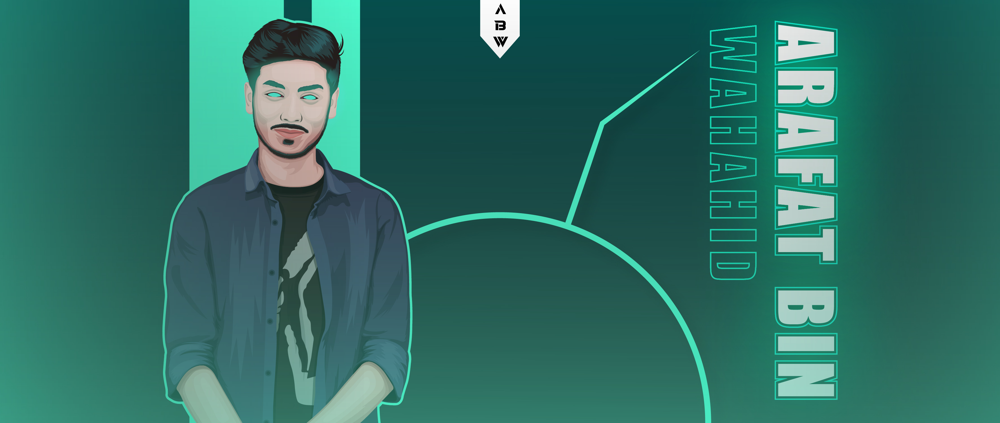

# Hi there 👋, My name is **Arafat Bin Wahahid**

## I am Full time freelancer and **_web designer_** and graphic designer.

I'm from **Bangladesh,** but I'm trying to stay as far as Irish weather as possible.
I'm currently hiding out in the Bangladeshi highlands, making websites for clients from all walks of life,

It's partly because I don't look Nice, but mainly because I can make beautiful,
**unique websites** appear online as if by magic. I'm also a **certified (Bangladesh Gov) sheikh kamal it training and incubation center for Web design and development (6 months),**
so if you need a new modern website, or you just want to revamp an old one,
I can get you up and running in no time.
I'll work directly with you to make the website that you need,
and show you how to keep the website up and running once you're ready to go it on your own.
**I'll take care of the magic part, but you have the final say.**

**Skills:** _HTML/ CSS/ JAVASCRIPT_

- 🔭 I’m currently **working** on **Ailanarco Web.**
- 🌱 I’m currently **learning** **React and Laravel.**
- 🤔 I’m **looking** for **help with Web Development.**
- 💬 **Ask** me about **HTML/ CSS/ JAVASCRIPT.**
- 📫 How to **reach** me: **Website Reference.**

    

   

